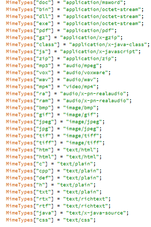
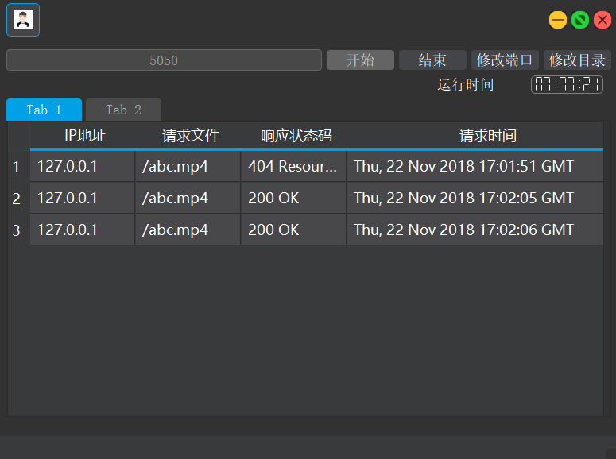

# socket编程

> 计网实验 socket编程

-  编程语言 C++
-  界面 Qt

- 界面如下

> 由于Qt 的UI线程（主线程）不允许耗时操作，所以必须开一个子线程来完成，这个线程使用的QT的内置线程,而当请求来时开的线程是  **windows** 的API,调用的createThread()函数（详情见 httpThread.cpp 文件）。

功能说明如下：
1. 开始后socket会监听左侧所示的端口
2. 结束停止监听
3. 修改端口
4. 修改初始化目录
5. 自动获取自己的公网ip,公网可访问
6. 可以请求常用的文件，如下图：

7. 显示

 - 数据第1行是指定目录下没有这个文件的输出，
 - 第2，3行是请求成功的输出。

中间的 `toast` 是仿 `Android` 的 `toast`

涉及的知识：

- socket 编程 ，

- 开多线程
  - Windows API: "pthread.h"
  -  QT： QThread的继承

- 子线程和主线程的同步，加锁的机制

- Qt UI的优化
